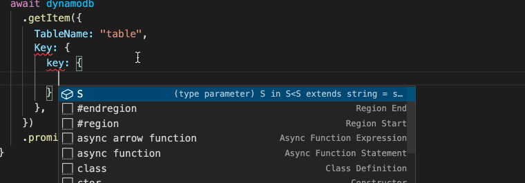
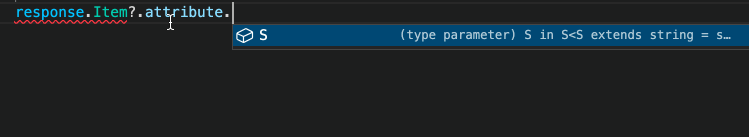
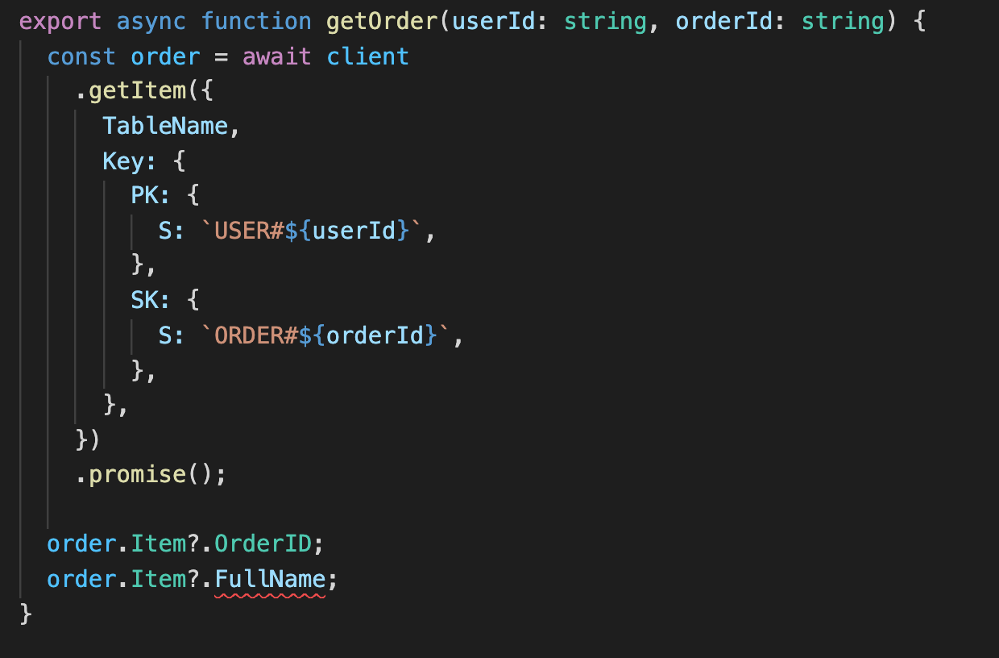
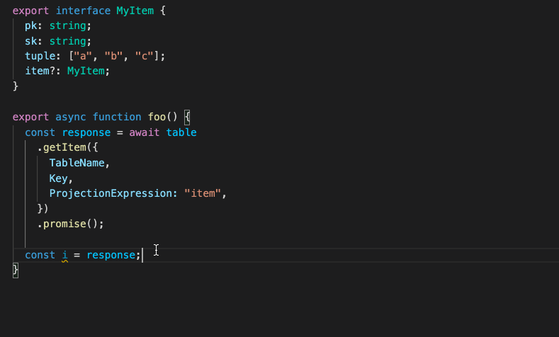
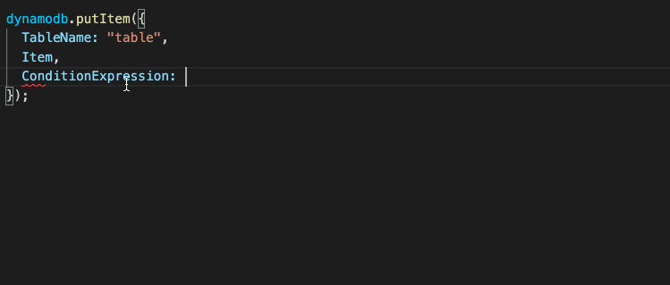
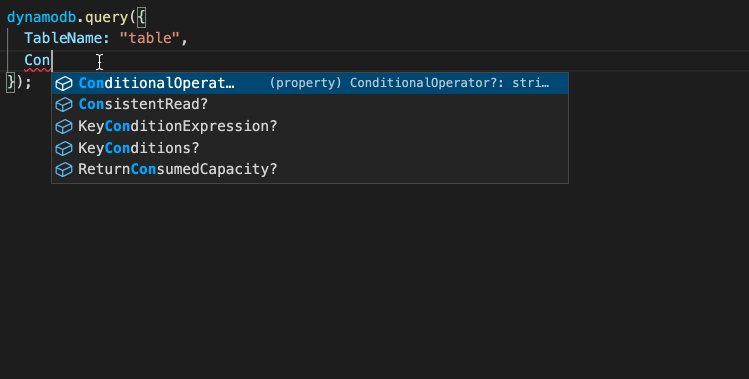

# typesafe-dynamodb

[](https://badge.fury.io/js/typesafe-dynamodb)

`typesafe-dynamodb` is a type-only library which replaces the type signatures of the AWS SDK's DynamoDB client. It substitutes `getItem`, `putItem`, `deleteItem` and `query` API methods with type-safe alternatives that are aware of the data in your tables and also adaptive to the semantics of the API request, e.g. by validating `ExpressionAttributeNames` and `ExpressionAttributeValues` contain all the values used in a `ConditionExpression` string, or by understanding the effect of a `ProjectionExpression` on the returned data type.

The end goal is to provide types that have total understanding of the AWS DynamoDB API and enable full utilization of the TypeScript type system for modeling complex DynmaoDB tables, such as the application of union types and template string literals for single-table designs.

## Installation

```
npm install --save-dev typesafe-dynamodb
```

## Usage

This library contains type definitions for both AWS SDK v2 (`aws-sdk`) and AWS SDK v3 (`@aws-sdk/client-dynamodb`);

### AWS SDK v2

To use `typesafe-dynamodb` with the AWS SDK v2, there is no need to change anything about your existing runtime code. It is purely type definitions, so you only need to cast an instance of `AWS.DynamoDB` to the `TypeSafeDynamoDBv2<T, HashKey, RangeKey>` interface and use the client as normal, except now you can enjoy a dynamic, type-safe experience in your IDE instead.

```ts
import { DynamoDB } from "aws-sdk";

const client = new DynamoDB();
```

Start by declaring a standard TypeScript interface which describes the structure of data in your DynamoDB Table:

```ts
interface Record {
  key: string;
  sort: number;
  attribute: string;
  // all types are allowed, such as recursive nested types
  records?: Record[];
}
```

Then, cast the `DynamoDB` client instance to `TypeSafeDynamoDB`;

```ts
import { TypeSafeDynamoDBv2 } from "typesafe-dynamodb/lib/client-v2";

const typesafeClient: TypeSafeDynamoDBv2<Record, "key", "sort"> = client;
```

`"key"` is the name of the Hash Key attribute, and `"sort"` is the name of the Range Key attribute.

Finally, use the client as you normally would, except now with intelligent type hints and validations.

### AWS SDK v3

#### Option 1 - DynamoDB (similar to SDK v2)

`DynamoDB` is an almost identical implementation to the AWS SDK v2, except with minor changes such as returning a `Promise` by default. It is a convenient way of using the DynamoDB API, except it is not optimized for tree-shaking (for that, see Option 2).

To override the types, follow a similar method to v2, except by importing TypeSafeDynamoDBv3 (instead of v2):

```ts
import { DynamoDB } from "@aws-sdk/client-dynamodb";
import { TypeSafeDynamoDBv3 } from "typesafe-dynamodb/lib/client-v3";

const client = new DynamoDB({..});
const typesafeClient: TypeSafeDynamoDBv3<Record, "key", "sort"> = client;
```

#### Option 2 - DynamoDBClient (a Command-Response interface optimized for tree-shaking)

`DynamoDBClient` is a generic interface with a single method, `send`. To invoke an API, call `send` with an instance of the API's corresponding `Command`.

This option is designed for optimal tree-shaking when bundling code, ensuring that the bundle only includes code for the APIs your application uses.

For this option, type-safety is achieved by declaring your own commands and then calling the standard `DynamoDBClient`:

```ts
interface MyType {
  key: string;
  sort: number;
  list: string[];
}

const client = new DynamoDBClient({});

const GetMyTypeCommand = TypeSafeGetItemCommand<MyType, "key", "sort">();

await client.send(
  new GetMyTypeCommand({
    ..
  })
);
```

### Document Client

Both the AWS SDK v2 and v3 provide a javascript-friendly interface called the `DocumentClient`. Instead of using the AttributeValue format, such as `{ S: "hello" }` or `{ N: "123" }`, the `DocumentClient` enables you to use native javascript types, e.g. `"hello"` or `123`.

#### AWS SDK V2

For the SDK V2 client, cast it to `TypeSafeDocumentClientV2`.

See: https://docs.aws.amazon.com/AWSJavaScriptSDK/latest/AWS/DynamoDB/DocumentClient.html

```ts
import { DynamoDB } from "aws-sdk";
import { TypeSafeDocumentClientV2 } from "typesafe-dynamodb/lib/document-client-v2";

const table = new DynamoDB.DocumentClient() as TypeSafeDocumentClientV2<
  MyItem,
  "pk",
  "sk"
>;
```

#### AWS SDK V3

When defining your Command types, use the corresponding `TypeSafe*DocumentCommand` type, for example `TypeSafeGetDocumentCommand` instead of `TypeSafeGetItemCommand`:

- GetItem - `TypeSafeGetDocumentCommand`
- PutItem - `TypeSafePutDocumentCommand`
- DeleteItem - `TypeSafeDeleteDocumentCommand`
- UpdateItem - `TypeSafeUpdateDocumentCommand`
- Query - `TypeSafeQueryDocumentCommand`
- Scan - `TypeSafeScanDocumentCommand`

See: https://docs.aws.amazon.com/AWSJavaScriptSDK/v3/latest/modules/_aws_sdk_lib_dynamodb.html

```ts
import { JsonFormat } from "typesafe-dynamodb";
import { TypeSafeGetDocumentCommand } from "typesafe-dynamodb/lib/get-document-command";

const MyGetItemCommand = TypeSafeGetDocumentCommand<MyType, "key", "sort">();
```

For the SDK V3 client, cast it to `TypeSafeDynamoDBv3`.

```ts
import { DynamoDBClient } from "@aws-sdk/client-dynamodb";
import { DynamoDBDocumentClient, PutCommand } from "@aws-sdk/lib-dynamodb";
import { TypeSafeDocumentClientV3 } from "typesafe-dynamodb/lib/document-client-v3";

const client = new DynamoDBClient({});

const docClient = DynamoDBDocumentClient.from(
  client
) as TypeSafeDocumentClientV3<MyType, "key", "sort">;
```

And then call `.send` with an instance of your TypeSafe Command:

```ts
docClient.send(new MyGetItemCommand({
  ..
}));
```

## Features

### Type-aware Input and Output

The type of the `Key` is derived from the `Record` type.



Same for the `Item` in the response:



### Single Table Design

Below are two `interface` declarations, representing two types of data stored in a single DynamoDB table - `User` and `Order`. Single table design in DynamoDB is achieved by creating "composite keys", e.g. `USER#${UserID}`. In TypeScript, we use template literal types to encode this in the Type System.

```ts
interface User<UserID extends string = string> {
  PK: `USER#${UserID}`;
  SK: `#PROFILE#${UserID}`;
  Username: string;
  FullName: string;
  Email: string;
  CreatedAt: Date;
  Address: string;
}

interface Order<
  UserID extends string = string,
  OrderID extends string = string
> {
  PK: `USER#${UserID}`;
  SK: `ORDER#${OrderID}`;
  Username: string;
  OrderID: string;
  Status: "PLACED" | "SHIPPED";
  CreatedAt: Date;
  Address: string;
}
```

With these two types defined, you can now use a union type to declare a `TypeSafeDynamoDB` instance aware of the two types of data in your tables:

```ts
const client: TypeSafeDynamoDB<User | Order, "PK", "SK">;
```

When making calls such as `getItem`, TypeScript will narrow the returned data type to the corresponding type based on the structure of the `Key` in your request:



### Type-Safe DynamoDBStreamEvent

Leverage your data types in Lambda Functions attached to the DynamoDB Table Stream:

```ts
import { DynamoDBStreamEvent } from "typesafe-dynamodb/lib/stream-event";

export async function handle(
  event: DynamoDBStreamEvent<User | Order, "PK", "SK", "KEYS_ONLY">
) {
  ..
}
```

The event's type is derived from the data type and the the `StreamViewType`, e.g. `"NEW_IMAGE" | "OLD_IMAGE" | "KEYS_ONLY" | "NEW_AND_OLD_IMAGES"`.

### Filter result with ProjectionExpression

The `ProjectionExpression` field is parsed and applied to filter the returned type of `getItem` and `query`.



### Filter with AttributesToGet

If you specify `AttributesToGet`, then the returned type only contains those properties.


### Validate ExpressionAttributeNames and ExpressionAttributeValues

If you add a `ConditionExpression` in `putItem`, you will be prompted for any `#name` or `:valu` placeholders:



Same is true for a `query`:



### Marshall a JS Object to an AttributeMap

A better type definition `@aws-sdk/util-dynamodb`'s `marshall` function is provided which maintains the typing information of the value passed to it and also adapts the output type based on the input `marshallOptions`

Given an object literal:

```ts
const myObject = {
  key: "key",
  sort: 123,
  binary: new Uint16Array([1]),
  buffer: Buffer.from("buffer", "utf8"),
  optional: 456,
  list: ["hello", "world"],
  record: {
    key: "nested key",
    sort: 789,
  },
} as const;
```

Call the `marshall` function to convert it to an AttributeMap which maintains the exact structure in the type system:

```ts
import { marshall } from "typesafe-dynamodb/lib/marshall";
// marshall the above JS object to its corresponding AttributeMap
const marshalled = marshall(myObject)

// typing information is carried across exactly, including literal types
const marshalled: {
  readonly key: S<"key">;
  readonly sort: N<123>;
  readonly binary: B;
  readonly buffer: B;
  readonly optional: N<456>;
  readonly list: L<readonly [S<"hello">, S<"world">]>;
  readonly record: M<...>;
}
```

### Unmarshall an AttributeMap back to a JS Object

A better type definition `@aws-sdk/util-dynamodb`'s `unmarshall` function is provided which maintains the typing information of the value passed to it and also adapts the output type based on the input `unmarshallOptions`.

```ts
import { unmarshall } from "typesafe-dynamodb/lib/marshall";

// unmarshall the AttributeMap back into the original object
const unmarshalled = unmarshall(marshalled);

// it maintains the literal typing information (as much as possible)
const unmarshalled: {
  readonly key: "key";
  readonly sort: 123;
  readonly binary: NativeBinaryAttribute;
  readonly buffer: NativeBinaryAttribute;
  readonly optional: 456;
  readonly list: readonly [...];
  readonly record: Unmarshall<...>;
}
```

If you specify `{wrapNumbers: true}`, then all `number` types will be wrapped as `{ value: string }`:

```ts
const unmarshalled = unmarshall(marshalled, {
  wrapNumbers: true,
});

// numbers are wrapped in { value: string } because of `wrappedNumbers: true`
unmarshalled.sort.value; // string

// it maintains the literal typing information (as much as possible)
const unmarshalled: {
  readonly key: "key";
  // notice how the number is wrapped in the `NumberValue` type?
  // this is because `wrapNumbers: true`
  readonly sort: NumberValue<123>;
  readonly binary: NativeBinaryAttribute;
  readonly buffer: NativeBinaryAttribute;
  readonly optional: NumberValue<...>;
  readonly list: readonly [...];
  readonly record: Unmarshall<...>;
};
```
